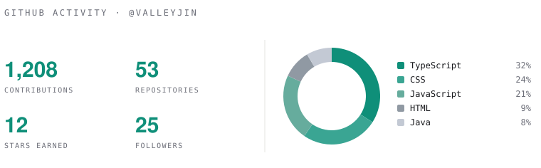

<!--
  ValleyJin — GitHub profile README (editorial, near-monochrome, single teal accent).
  Lives in the special repo ValleyJin/valleyjin. Header art is in assets/header-*.svg
  and adapts to the viewer's light/dark theme via <picture>.
-->

<picture>
  <source media="(prefers-color-scheme: dark)" srcset="assets/header-dark.svg">
  
</picture>

 

### Currently

- Serving open LLMs at scale — **vLLM on Google Cloud Run** · [vllm-cloud-run](https://github.com/ValleyJin/vllm-cloud-run)
- Ethereum & OP-stack **Layer-2 infrastructure** with Tokamak Network · [TONStarter](https://github.com/tokamak-network/TONStarter)
- **Physical AI** — ontology-based reasoning for embodied agents · [knowrob_OPAL](https://github.com/ValleyJin/knowrob_OPAL)
- Full-stack product engineering — React · TypeScript · Spring · Java

### Focus

<table>
  <tr>
    <td width="50%" valign="top">
      <b>AI · LLM &amp; Cloud</b> 
      Inference at scale, autoscaling GPU workloads, agentic pipelines.
    </td>
    <td width="50%" valign="top">
      <b>Blockchain</b> 
      Ethereum &amp; OP-stack L2, on-chain launch infrastructure.
    </td>
  </tr>
  <tr>
    <td valign="top">
      <b>Physical AI</b> 
      Knowledge representation &amp; reasoning for robotics (KnowRob).
    </td>
    <td valign="top">
      <b>Full-stack</b> 
      React / TypeScript front-ends over Spring / Java services.
    </td>
  </tr>
</table>

### Launched

<table>
  <tr>
    <td width="56%" valign="middle">
      <b><a href="https://kyopo.ai">Kyopo AI</a></b> &nbsp;·&nbsp; <i>solo, end-to-end</i>  
      A <b>multilingual batch-translation system</b> that <b>7 AI agents develop and operate
      automatically</b>. Excel · Word · HWPX · PPT · PDF · Google Workspace → <b>50+ languages</b>
      in one pass, formatting preserved. Sentence caching cuts cost up to 80%; glossary,
      0%-omission checks, and TTS in 40+ languages. Powered by K3I's PersonaXR deep-persona AI.  
      <a href="https://kyopo.ai">kyopo.ai&nbsp;→</a>
    </td>
    <td width="44%">
      
    </td>
  </tr>
</table>

### GitHub

<picture>
  <source media="(prefers-color-scheme: dark)" srcset="assets/stats-dark.svg">
  
</picture>

 
 
